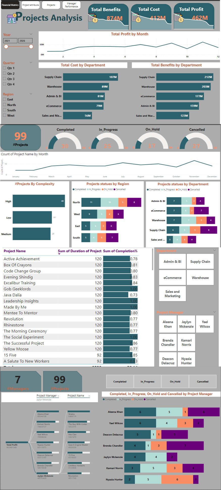

# 📊 Projects Analysis Dashboard  

  

## 📝 Overview  
This dashboard provides a comprehensive analysis of project performance and management, offering insights into financial metrics, project statuses, regional progress, departmental benefits, and project manager performance. It enables better decision-making and project optimization.  

### Key Metrics  
- 💰 **Financial Metrics**: Total Benefits ($874M), Total Costs ($412M), and Total Profit ($462M).  
- 📋 **Project Statuses**: Breakdown of Completed, In Progress, On Hold, and Cancelled projects.  
- 📈 **Trends Over Time**: Profit and project count visualized monthly.  
- 🏢 **Departmental Insights**: Total cost and benefits by department.  
- 🌎 **Regional Analysis**: Project statuses across East, West, North, and South regions.  

---

## 🔍 Features  
- **Financial Overview**: Key performance indicators for project profitability.  
- **Project Complexity**: Projects categorized as High, Medium, or Low complexity.  
- **Manager Performance**: Projects managed, status breakdown, and profit contribution by each manager.  
- **Top Projects by Duration and Completion**: Detailed list of project names, duration, and completion rates.  
- **Dynamic Filters**: Drill down by year, quarter, region, department, and project manager for customized analysis.  

---

## 💡 Use Cases  
This dashboard is ideal for:  
1. **Project Managers**: To monitor progress, identify delays, and improve efficiency.  
2. **Executives**: To track overall profitability and departmental contributions.  
3. **Operations Teams**: To allocate resources effectively based on complexity and status.  

---

## 🛠 How to Use  
1. Clone the repository:  
   ```bash
   git clone https://github.com/yourusername/projects-analysis-dashboard.git
